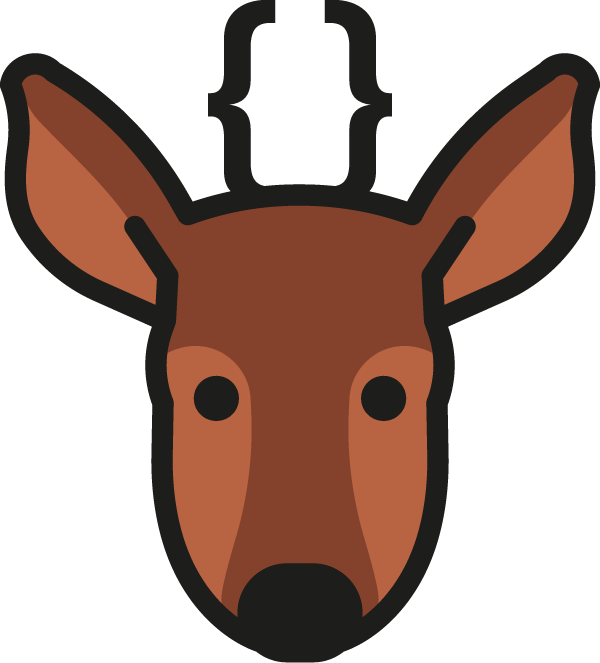
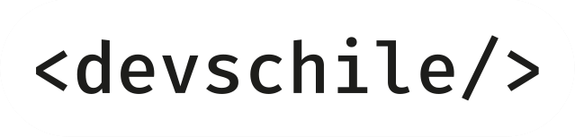

# devsChile — Sistema de diseño

Referencia de marca y diseño de devsChile, para reusar en otros proyectos.
Combina la identidad de marca oficial (creada en el año 2018, usada en impresos/merch/redes) con
el sistema de diseño para productos web que se usó al construir [pegas.devschile.cl](https://pegas.devschile.cl).
Este último es una evolución para pantalla, no un rediseño oficial de la marca.

Si estás partiendo un proyecto nuevo de devsChile: usa el **logo y la
identidad** tal cual (sección 1), y el **sistema de diseño web** (sección 2)
como punto de partida razonable para la interfaz, ajustándolo al contexto del
proyecto, en vez de copiarlo literal.

## 1. Identidad de marca

### Isotipo y logotipo

devsChile se identifica con un huemul (hippocamelus bisulcus) cuyas astas están
dibujadas como llaves de código `{ }`, este es el detalle que conecta la marca con
el desarrollo web. Ese huemul es el isotipo. Lo acompaña el logotipo
`<devschile/>`, escrito como una etiqueta HTML.

| Icono (huemul solo)                      | Logotipo                                         |
| ---------------------------------------- | ------------------------------------------------ |
|  |  |

Los dos forman parte del kit oficial. El logotipo casi nunca se usa solo: el
ícono de huemul cumple ese rol como favicon o avatar. El imagotipo combinado
(isotipo y logotipo en una sola pieza) no viene en este repo; para
conseguirlo armado, revisa el kit completo en "Kit completo de assets" más
abajo.

### Variantes por fondo

El isotipo tiene tres variantes documentadas para uso sobre fondo claro u
oscuro:

1. **Full color** — sobre fondo claro, sin contorno adicional:
   `assets/brand/huemul-icono.svg`.
2. **Full color + contorno blanco** — sobre fondo oscuro, el huemul mantiene
   sus colores pero con un trazo blanco que lo separa del fondo:
   `assets/brand/huemul-icono-contorno.svg`.
3. **Monocromo blanco** — sobre fondo oscuro u oscuro/foto, todo el isotipo
   en blanco sólido: `assets/brand/huemul-icono-blanco.png`. Es blanco sobre
   transparente, así que se ve invisible en un visor con fondo claro —
   pruébala sobre un fondo oscuro antes de asumir que el archivo está vacío.

### Paleta oficial de marca (2018)

Para uso impreso, merch, y cualquier lugar donde el isotipo aparezca en sus
colores originales:

|                 | Hex       | RGB         | CMYK           | Pantone |
| --------------- | --------- | ----------- | -------------- | ------- |
| Huemul — oscuro | `#85422b` | 133, 66, 43 | 32, 74, 79, 37 | 7601 C  |
| Huemul — claro  | `#b45b38` | 180, 91, 56 | 23, 70, 80, 13 | 7585 C  |
| Trazo / texto   | `#1d1d1b` | —           | —              | —       |

**Tipografía de marca:** Fira Mono (medium). Coherente con el logotipo
en formato de tag HTML — la marca es "de developer" incluso en la
tipografía.

### Kit completo de assets

Este repo incluye copias locales del isotipo, el logotipo y la variante
monocroma blanca (para que este documento no dependa de links externos), pero
el kit completo — imagotipo combinado, versión vectorial (`.ai`), guía de uso
en PDF, troquel para stickers, mockups — vive en:

- **[github.com/devschile/media-press](https://github.com/devschile/media-press)**,
  el banco de logotipos oficiales. La licencia con la que se distribuye está
  detallada en [`docs/assets.md`](docs/assets.md), sección "Licencia de los
  assets de marca".
- El logotipo también está disponible suelto en
  [tienda.devschile.cl](https://tienda.devschile.cl/assets/devschile2026-DBecIXs_.png).

### Reglas de uso

- No deformar el huemul, separar las astas-llave del resto del icono, ni
  pegar el isotipo o el logotipo a los bordes o sobreponerlos con texto:
  siempre dejar espacio de respiro alrededor.
- Sobre fondo oscuro, preferir la variante con contorno blanco o la
  monocroma antes que forzar los colores originales sin ajuste.
- Uso comercial o modificaciones: requieren permiso explícito (ver
  licencia del media-press).

## 2. Sistema de diseño web

Esto es lo que se usó construyendo pegas.devschile.cl — un theme oscuro con
acento _teal_, pensado para sitios y herramientas internas para desarrolladores. Es una base para
generar productos digitales.

### Filosofía

Fondo oscuro con gradiente sutil (no plano), un solo color de acento vibrante
usado con disciplina (texto de énfasis, bordes en hover, botones, pero no en
todo), tarjetas con efecto vidrio esmerilado (`backdrop-filter: blur`) y
tipografía monoespaciada en títulos para reforzar el tono "hecho por y para
devs", igual que el logotipo.

### Color

```css
:root {
  --bg: #100a1c;
  --bg-gradient: radial-gradient(50% 30% ellipse at center top, #201e40 0%, rgba(0, 0, 0, 0) 100%), radial-gradient(60% 50% ellipse at center bottom, #261226 0%, #100a1c 100%);
  --surface: rgba(32, 30, 64, 0.6);
  --surface-hover: rgba(45, 212, 191, 0.08);
  --border: rgba(255, 255, 255, 0.08);
  --border-hover: rgba(45, 212, 191, 0.3);
  --text: #fff;
  --text-muted: rgba(255, 255, 255, 0.55);
  --accent: #2dd4bf; /* teal — el color de acento del proyecto */
  --accent-hover: #5ee8d4;
}
```

El acento (`#2dd4bf`, teal) es intercambiable por proyecto — no es parte de
la identidad de marca oficial, es una decisión de este producto en
particular. Lo que sí vale la pena mantener entre proyectos es el _patrón_:
un solo acento, usado consistentemente, sobre un fondo oscuro con textura
(gradiente radial, no un plano sólido).

Un segundo acento (verde, `#4ade80` / `rgba(34,197,94,0.18)` de fondo) se usa
puntualmente para estados positivos/badges tipo "disponible". No compite con
el acento principal porque aparece en contextos distintos (badge vs.
texto/bordes).

### Tipografía

```css
--font-body: 'Fira Sans', 'Droid Sans', 'Helvetica Neue', sans-serif;
--font-heading: 'Inconsolata', monospace;
```

Todos los títulos (`h1`–`h6`) usan la variante monoespaciada. El body usa una
sans-serif legible: mismo criterio que la tipografía de marca, donde lo
monoespaciado marca jerarquía sin perjudicar la lectura de párrafos largos.

### Espaciado y forma

Todos estos valores — y la paleta, tipografía, sombras, duraciones y capas de
la sección de color — están formalizados como tokens en
[`chucao-tokens.json`](chucao-tokens.json) (`spacing`, `radius`, `border`,
`shadow`, `duration`, `easing`, `focus`, `opacity`, `z-index`, `effect`), que
se consumen como `var(--token-name)` desde los componentes.

- Radio de borde base: `6px` (`--radius`) para inputs, botones rectangulares,
  tarjetas.
- Elementos tipo "pill" (badges, botones de acción primaria): `border-radius: 999px`.
- Tarjetas con `backdrop-filter: blur(10px)` sobre `--surface` — efecto
  vidrio esmerilado, no fondos sólidos opacos.
- Borde de 1px sutil (`--border`) en reposo, que se intensifica al acento en
  hover (`--border-hover`). El hover casi nunca cambia el fondo entero: cambia
  el borde y a veces agrega una sombra suave con el color de acento.

### Componentes de referencia

**Tarjeta con acento lateral en hover** — patrón usado para listados (como pegas,
podría ser cualquier lista de items):

```css
.card {
  background: var(--surface);
  border: 1px solid var(--border);
  border-radius: var(--radius);
  padding: 1.35rem 1.5rem;
  backdrop-filter: blur(10px);
  position: relative;
  overflow: hidden;
  transition:
    border-color 0.2s,
    transform 0.15s,
    box-shadow 0.2s;
}
.card::before {
  content: '';
  position: absolute;
  left: 0;
  top: 0;
  bottom: 0;
  width: 3px;
  background: var(--accent);
  opacity: 0;
  transition: opacity 0.2s;
}
.card:hover {
  border-color: var(--border-hover);
  transform: translateX(2px);
  box-shadow: 0 4px 20px rgba(45, 212, 191, 0.06);
}
.card:hover::before {
  opacity: 1;
}
```

**Badge/pill** — para categorías, tags, metadata secundaria:

```css
.badge {
  padding: 0.18rem 0.6rem;
  border-radius: 999px;
  font-size: 0.68rem;
  font-weight: 600;
  text-transform: uppercase;
  letter-spacing: 0.03em;
  background: rgba(45, 212, 191, 0.15);
  color: var(--accent);
}
```

**Botón de acción primaria** — pill sólido en el color de acento, no un link
subrayado:

```css
.btn-primary {
  display: inline-flex;
  align-items: center;
  gap: 0.35rem;
  background-color: var(--accent);
  color: #06210f; /* texto oscuro, no blanco, sobre el acento claro */
  font-weight: 700;
  padding: 0.25rem 0.8rem;
  border-radius: 999px;
  transition:
    background-color 0.2s,
    transform 0.15s;
}
.btn-primary:hover {
  background-color: var(--accent-hover);
  transform: translateY(-1px);
}
```

**Inputs y selects** — mismo tratamiento que las tarjetas (surface + blur),
foco con anillo del color de acento:

```css
input,
select {
  padding: 0.8rem 1.25rem;
  border-radius: var(--radius);
  border: 1px solid var(--border);
  background: var(--surface);
  color: var(--text);
  backdrop-filter: blur(10px);
}
input:focus {
  border-color: var(--accent);
  box-shadow: 0 0 0 3px rgba(45, 212, 191, 0.12);
  outline: none;
}
```

### Qué SÍ y qué NO

- Sí: un acento, usado con disciplina. No: dos o tres colores "de marca"
  compitiendo en la misma pantalla.
- Sí: hover que cambia borde/sombra/transform. No: hover que cambia el fondo
  completo de golpe (rompe el estilo "vidrio" del resto).
- Sí: `999px` para pills, `6px` para contenedores. No mezclar radios
  arbitrarios.
- Sí: headings en monoespaciada. No: todo el texto en monoespaciada.
- Sí: reusar el acento teal si no hay una razón de marca para cambiarlo (no
  es identidad oficial, ver "Color").

## Ejemplo en producción

[pegas.devschile.cl](https://pegas.devschile.cl) — código en
[`css/style.css`](css/style.css) e [`index.html`](index.html) de este
mismo repo.
