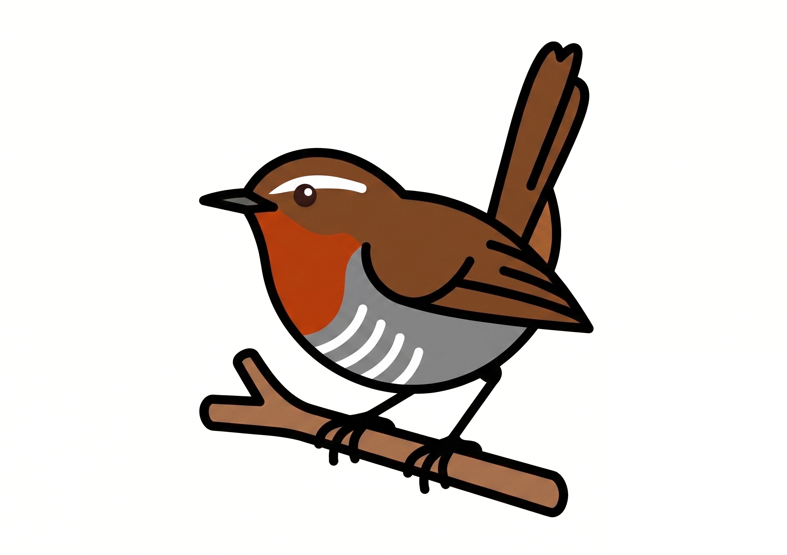

[![Built With Stencil](https://img.shields.io/badge/-Built%20With%20Stencil-16161d.svg?logo=data%3Aimage%2Fsvg%2Bxml%3Bbase64%2CPD94bWwgdmVyc2lvbj0iMS4wIiBlbmNvZGluZz0idXRmLTgiPz4KPCEtLSBHZW5lcmF0b3I6IEFkb2JlIElsbHVzdHJhdG9yIDE5LjIuMSwgU1ZHIEV4cG9ydCBQbHVnLUluIC4gU1ZHIFZlcnNpb246IDYuMDAgQnVpbGQgMCkgIC0tPgo8c3ZnIHZlcnNpb249IjEuMSIgaWQ9IkxheWVyXzEiIHhtbG5zPSJodHRwOi8vd3d3LnczLm9yZy8yMDAwL3N2ZyIgeG1sbnM6eGxpbms9Imh0dHA6Ly93d3cudzMub3JnLzE5OTkveGxpbmsiIHg9IjBweCIgeT0iMHB4IgoJIHZpZXdCb3g9IjAgMCA1MTIgNTEyIiBzdHlsZT0iZW5hYmxlLWJhY2tncm91bmQ6bmV3IDAgMCA1MTIgNTEyOyIgeG1sOnNwYWNlPSJwcmVzZXJ2ZSI%2BCjxzdHlsZSB0eXBlPSJ0ZXh0L2NzcyI%2BCgkuc3Qwe2ZpbGw6I0ZGRkZGRjt9Cjwvc3R5bGU%2BCjxwYXRoIGNsYXNzPSJzdDAiIGQ9Ik00MjQuNywzNzMuOWMwLDM3LjYtNTUuMSw2OC42LTkyLjcsNjguNkgxODAuNGMtMzcuOSwwLTkyLjctMzAuNy05Mi43LTY4LjZ2LTMuNmgzMzYuOVYzNzMuOXoiLz4KPHBhdGggY2xhc3M9InN0MCIgZD0iTTQyNC43LDI5Mi4xSDE4MC40Yy0zNy42LDAtOTIuNy0zMS05Mi43LTY4LjZ2LTMuNkgzMzJjMzcuNiwwLDkyLjcsMzEsOTIuNyw2OC42VjI5Mi4xeiIvPgo8cGF0aCBjbGFzcz0ic3QwIiBkPSJNNDI0LjcsMTQxLjdIODcuN3YtMy42YzAtMzcuNiw1NC44LTY4LjYsOTIuNy02OC42SDMzMmMzNy45LDAsOTIuNywzMC43LDkyLjcsNjguNlYxNDEuN3oiLz4KPC9zdmc%2BCg%3D%3D&colorA=16161d&style=flat-square)](https://stenciljs.com)

# Chucao



Kit de marca + sistema de diseño web de devsChile, listo para reusar en
proyectos nuevos. Pensado para copiarse y usarse directo, sin depender de
piezas externas.

🔗 **[devschile.github.io/chucao](https://devschile.github.io/chucao/)**
- guía gráfica: paleta, tipografía, todas las variantes del isotipo y el set
de favicon, renderizados 
- rama `docs`, publicada con GitHub Pages

**Empieza por [`DESIGN.md`](DESIGN.md)** — es la referencia completa: identidad
de marca (isotipo y logotipo, paleta oficial, reglas de uso) y el sistema de diseño web
(colores, tipografía, componentes CSS de referencia) que se usó construyendo
[pegas.devschile.cl](https://pegas.devschile.cl) y
[semanario.devschile.cl](https://semanario.devschile.cl).

Este proyecto agrega lo que `DESIGN.md` describe pero no traía: los
archivos de imagen reales.

Además, el sistema de diseño está empaquetado como una librería de Web
Components framework-agnostic hecha con [StencilJS](https://stenciljs.com),
publicada en npm como `@devschile/chucao` (ver más abajo, "Librería de
componentes (StencilJS)").

## Librería de componentes (StencilJS)

El sistema de diseño de Chucao (colores, tipografía, espaciado, layout — ver
[`DESIGN.md`](DESIGN.md) y [`chucao-tokens.json`](chucao-tokens.json))
está empaquetado como Web Components framework-agnostic usando
[StencilJS](https://stenciljs.com), publicados en npm como `@devschile/chucao`.

Los componentes de Stencil son simplemente Web Components estándar, así que
funcionan en React, Vue, Angular, Svelte o sin ningún framework.

### Getting started

```bash
npm install
npm start
```

To build the components for production:

```bash
npm run build
```

To run the unit and component tests:

```bash
npm test
```

Need help with Stencil itself? Check out the
[docs](https://stenciljs.com/docs/my-first-component).

### Project structure

```
src/
├── components/   Stencil components (one folder per component)
├── tokens/       Design tokens generated by toki — do not edit by hand
├── utils/        Shared helpers used by components
└── index.ts      Public entry point (re-exports tokens & utilities)
```

### Design tokens

The files under [`src/tokens`](src/tokens) (`tokens.ts`, `tokens.css`,
`tokens.d.ts`, `types.ts`) are generated from
[`chucao-tokens.json`](chucao-tokens.json) by
[toki](https://github.com/devschile/toki) — **do not edit them by hand**, and
see [`src/tokens/README.md`](src/tokens/README.md) for their naming
conventions, CSS custom properties and TypeScript usage.

### Naming components

When creating new component tags, avoid using `chucao` or `stencil` alone as
the tag name; instead prefix component tags with `chucao-` (e.g.
`chucao-button`) so they don't collide with other libraries on the page.

### Using this library

There are two strategies to consume Stencil component libraries published to
npm. You can read more about them in the
[Stencil docs](https://stenciljs.com/docs/publishing).

#### Lazy loading

If your project is built with the [`dist`](https://stenciljs.com/docs/distribution)
output target, import a small bootstrap script that registers all components
and loads individual component scripts lazily:

```html
<script type="module" src="https://unpkg.com/@devschile/chucao"></script>
<!--
To avoid unpkg.com redirects to the actual file, you can also directly import:
https://unpkg.com/@devschile/chucao@0.0.1/dist/chucao/chucao.esm.js
-->
<my-component first="Stencil" middle="'Don't call me a framework'" last="JS"></my-component>
```

You can also import the script as part of your `node_modules` in your
application's entry file:

```tsx
import '@devschile/chucao/dist/chucao/chucao.esm.js';
```

#### Standalone

If you'd rather import components individually as plain Web Components (e.g.
in a Svelte/SvelteKit app, which has first-class custom-elements support and
needs no extra wrapper package), use the
[`dist-custom-elements`](https://stenciljs.com/docs/custom-elements) output
target:

```tsx
import '@devschile/chucao/my-component';

function App() {
  return (
    <div>
      <my-component
        first="Stencil"
        middle="'Don't call me a framework'"
        last="JS"
      ></my-component>
    </div>
  );
}

export default App;
```

### Framework wrappers

In addition to the framework-agnostic Web Components above, this library
ships dedicated wrapper packages so components feel native in React and Vue.

#### React

Components are wrapped with
[`@stencil/react-output-target`](https://www.npmjs.com/package/@stencil/react-output-target),
built to `dist-react/` and exposed as `@devschile/chucao/react`. Install the
runtime peer dependency in your React app:

```bash
npm install @stencil/react-output-target
```

```tsx
import { MyComponent } from '@devschile/chucao/react';

function App() {
  return <MyComponent first="Stencil" middle="'Don't call me a framework'" last="JS" />;
}

export default App;
```

#### Vue

Components are wrapped with
[`@stencil/vue-output-target`](https://www.npmjs.com/package/@stencil/vue-output-target),
built to `dist-vue/` and exposed as `@devschile/chucao/vue`:

```vue
<script setup lang="ts">
import { MyComponent } from '@devschile/chucao/vue';
</script>

<template>
  <MyComponent first="Stencil" middle="'Don't call me a framework'" last="JS" />
</template>
```

#### Svelte / SvelteKit

Svelte doesn't need a dedicated wrapper package — it has first-class support
for custom elements, so the standalone approach above (importing from
[`dist-custom-elements`](https://stenciljs.com/docs/custom-elements)) works
directly:

```svelte
<script lang="ts">
  import '@devschile/chucao/my-component';
</script>

<my-component first="Stencil" middle="'Don't call me a framework'" last="JS"></my-component>
```

In SvelteKit, guard the import so it only runs in the browser (custom
elements rely on the DOM), e.g. inside `onMount` or a `+layout.ts` with
`browser` from `$app/environment`.

## Qué hay en `assets/`

```
assets/
├── brand/
│   ├── huemul-icono.png            El huemul solo, full color (600×663)
│   ├── huemul-icono.svg            Igual, vector real
│   ├── huemul-icono-contorno.svg   El huemul + contorno blanco, para fondo oscuro, vector real
│   ├── huemul-icono-trazo.svg      Solo el trazo, sin relleno, vector real (extra, no es
│   │                                 una de las 3 variantes oficiales de DESIGN.md)
│   ├── huemul-icono-blanco.png     El huemul solo, monocromo blanco (593×665)
│   ├── huemul-icono-blanco.svg     Igual, ver nota abajo sobre este archivo
│   ├── devschile-wordmark.png      "<devschile/>", solo texto (639×153)
│   └── devschile-wordmark.svg      Igual, vector real
│
└── favicon/
    ├── favicon.ico                 Multi-resolución (16/32/48), navegadores viejos
    ├── favicon-16x16.png
    ├── favicon-32x32.png
    ├── favicon-48x48.png
    ├── apple-touch-icon.png        180×180
    ├── android-chrome-192x192.png
    ├── android-chrome-512x512.png
    ├── favicon.svg
    ├── site.webmanifest
    └── huemul-icono-cuadrado.png   Base cuadrada (663×663, con relleno
                                     transparente) sin comprimir — fuente
                                     limpia para generar otros tamaños
```

Los nombres en `assets/brand/` coinciden a propósito con las rutas que ya usa
la tabla de `DESIGN.md` (`assets/brand/huemul-icono.png`, etc.), así que el
markdown no necesita ningún ajuste.

### ⚠️ Sobre `huemul-icono-blanco.svg`

Es el único `.svg` que sigue siendo _placeholder_: el PNG original embebido tal
cual dentro de un contenedor `<svg><image href="data:image/png;base64,...">`.
Sirve para cualquier lugar que pida la extensión `.svg`, pero no es un _path_
editable ni escala con nitidez real ya que sigue siendo un _raster_.

El resto de los `.svg` de `assets/brand/` (`huemul-icono`,
`huemul-icono-contorno`, `huemul-icono-trazo`, `devschile-wordmark`) **son
vectorizados reales**, con paths editables.
Si consigues la variante monocroma blanca en vector, reemplaza
`huemul-icono-blanco.svg` con eso y esta nota deja de aplicar.

### Uso rápido del favicon

```html
<link rel="icon" href="/favicon/favicon.ico" sizes="any">
<link rel="icon" type="image/svg+xml" href="/favicon/favicon.svg">
<link rel="apple-touch-icon" href="/favicon/apple-touch-icon.png">
<link rel="manifest" href="/favicon/site.webmanifest">
```

## Licencia de los assets de marca

Los archivos de `assets/brand/` reproducen el mismo logo oficial de devsChile que está en
[devschile/media-press](https://github.com/devschile/media-press), bajo
[CC BY-NC-ND 4.0](http://creativecommons.org/licenses/by-nc-nd/4.0/):
**atribución, no comercial, sin derivados**. Los PNG son copias directas sin
modificar, los `.svg` vectoriales (todos salvo `huemul-icono-blanco.svg`) son
el mismo diseño exportado con paths reales, y el set de favicon es una
redimensión del icono. Nada cambia el color, la forma ni el trazo del
isotipo, así que todos caen bajo la misma licencia.

Para proyectos de la propia comunidad devsChile esto ya está cubierto (ver
"Reglas de uso" en `DESIGN.md`). Para cualquier uso comercial, o para
modificar el logo más allá de lo que hay acá, se necesita permiso explícito de
los administradores de devsChile. El imagotipo combinado, la versión
vectorial (`.ai`) y la documentación oficial (guía de estilo, guía de uso,
troquel de stickers) no se incluyen acá: están en
[devschile/media-press](https://github.com/devschile/media-press).

## Cómo reusar esto en un proyecto nuevo

1. Copia `DESIGN.md` al proyecto (o solo referéncialo desde acá) para tener a
   mano la paleta, tipografía y componentes CSS de referencia — sección
   "2. Sistema de diseño web".
2. Copia de `assets/` lo que el proyecto necesite: como mínimo el favicon y el
   `huemul-icono.png` (o `.svg`) para el header.
3. El acento teal (`#2dd4bf`) es intercambiable; el isotipo y el logotipo no
   lo son (ver "Reglas de uso" en `DESIGN.md`).

*Hecho por la comunidad, para la comunidad. 🦌*
