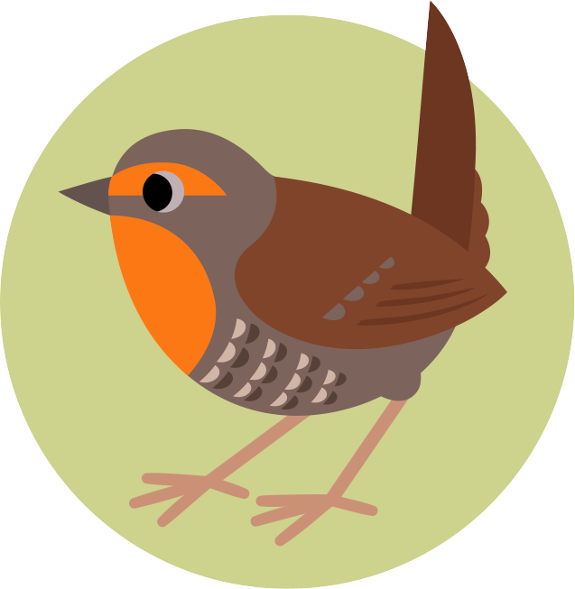

[![Built With Stencil](https://img.shields.io/badge/-Built%20With%20Stencil-16161d.svg?logo=data%3Aimage%2Fsvg%2Bxml%3Bbase64%2CPD94bWwgdmVyc2lvbj0iMS4wIiBlbmNvZGluZz0idXRmLTgiPz4KPCEtLSBHZW5lcmF0b3I6IEFkb2JlIElsbHVzdHJhdG9yIDE5LjIuMSwgU1ZHIEV4cG9ydCBQbHVnLUluIC4gU1ZHIFZlcnNpb246IDYuMDAgQnVpbGQgMCkgIC0tPgo8c3ZnIHZlcnNpb249IjEuMSIgaWQ9IkxheWVyXzEiIHhtbG5zPSJodHRwOi8vd3d3LnczLm9yZy8yMDAwL3N2ZyIgeG1sbnM6eGxpbms9Imh0dHA6Ly93d3cudzMub3JnLzE5OTkveGxpbmsiIHg9IjBweCIgeT0iMHB4IgoJIHZpZXdCb3g9IjAgMCA1MTIgNTEyIiBzdHlsZT0iZW5hYmxlLWJhY2tncm91bmQ6bmV3IDAgMCA1MTIgNTEyOyIgeG1sOnNwYWNlPSJwcmVzZXJ2ZSI%2BCjxzdHlsZSB0eXBlPSJ0ZXh0L2NzcyI%2BCgkuc3Qwe2ZpbGw6I0ZGRkZGRjt9Cjwvc3R5bGU%2BCjxwYXRoIGNsYXNzPSJzdDAiIGQ9Ik00MjQuNywzNzMuOWMwLDM3LjYtNTUuMSw2OC42LTkyLjcsNjguNkgxODAuNGMtMzcuOSwwLTkyLjctMzAuNy05Mi43LTY4LjZ2LTMuNmgzMzYuOVYzNzMuOXoiLz4KPHBhdGggY2xhc3M9InN0MCIgZD0iTTQyNC43LDI5Mi4xSDE4MC40Yy0zNy42LDAtOTIuNy0zMS05Mi43LTY4LjZ2LTMuNkgzMzJjMzcuNiwwLDkyLjcsMzEsOTIuNyw2OC42VjI5Mi4xeiIvPgo8cGF0aCBjbGFzcz0ic3QwIiBkPSJNNDI0LjcsMTQxLjdIODcuN3YtMy42YzAtMzcuNiw1NC44LTY4LjYsOTIuNy02OC42SDMzMmMzNy45LDAsOTIuNywzMC43LDkyLjcsNjguNlYxNDEuN3oiLz4KPC9zdmc%2BCg%3D%3D&colorA=16161d&style=flat-square)](https://stenciljs.com)

# Chucao

_Isotipo diseñado por [@irmirx](https://www.instagram.com/irmirx/); su uso en
este proyecto está aprobado por la autora._

Kit de marca + sistema de diseño web de devsChile, listo para reusar en
proyectos nuevos. Pensado para copiarse y usarse directo, sin depender de
piezas externas.

🔗 **[devschile.github.io/chucao](https://devschile.github.io/chucao/)**

- guía gráfica: paleta, tipografía, todas las variantes del isotipo y el set
  de favicon, renderizados
- rama `docs`, publicada con GitHub Pages

## Qué contiene este repo

- **La identidad de marca y el sistema de diseño web**, documentados en
  [`DESIGN.md`](DESIGN.md) — la referencia completa que se usó construyendo
  [pegas.devschile.cl](https://pegas.devschile.cl) y
  [semanario.devschile.cl](https://semanario.devschile.cl). Este proyecto
  agrega los archivos de imagen reales que `DESIGN.md` describe pero no traía.
- **Los assets de marca** (isotipo, logotipo, favicons) en [`assets/`](assets/)
  — inventario, uso y licencia en [`docs/assets.md`](docs/assets.md).
- **Una librería de Web Components** framework-agnostic hecha con
  [StencilJS](https://stenciljs.com), publicada en npm como
  `@devschile/chucao` — desarrollo y convenciones en
  [`docs/components.md`](docs/components.md), consumo en
  [`docs/using-the-library.md`](docs/using-the-library.md).

## Documentación

| Documento                                                | Idioma  | Contenido                                                                      |
| -------------------------------------------------------- | ------- | ------------------------------------------------------------------------------ |
| [`CONTRIBUTING.md`](CONTRIBUTING.md)                     | Español | Cómo contribuir: flujo de trabajo, commits, proponer un componente             |
| [`AGENTS.md`](AGENTS.md)                                 | English | Convenciones del repo para contribuyentes y agentes de IA                      |
| [`SECURITY.md`](SECURITY.md)                             | Español | Cómo reportar un problema de seguridad y versiones soportadas                  |
| [`DESIGN.md`](DESIGN.md)                                 | Español | Identidad de marca + sistema de diseño web                                     |
| [`docs/assets.md`](docs/assets.md)                       | Español | Inventario de `assets/`, uso del favicon, licencia                             |
| [`docs/components.md`](docs/components.md)               | English | Desarrollo de la librería StencilJS: estructura, tokens, convenciones          |
| [`docs/using-the-library.md`](docs/using-the-library.md) | English | Cómo consumir `@devschile/chucao` (lazy loading, standalone, React/Vue/Svelte) |
| [`docs/releasing.md`](docs/releasing.md)                 | English | Cómo publicar releases y desplegar la librería al CDN                          |
| [`docs/testing.md`](docs/testing.md)                     | English | Testing y cobertura de los componentes                                         |
| [`docs/storybook.md`](docs/storybook.md)                 | English | Evaluación de desplegar Storybook en el CDN (no adoptado)                      |
| [`docs/backlog.md`](docs/backlog.md)                     | English | Plan por incrementos hacia la próxima versión (`CH-*`) y backlog de releases   |

## Cómo reusar esto en un proyecto nuevo

1. Copia `DESIGN.md` al proyecto (o solo referéncialo desde acá) para tener a
   mano la paleta, tipografía y componentes CSS de referencia — sección
   "2. Sistema de diseño web".
2. Copia de `assets/` lo que el proyecto necesite: como mínimo el favicon y el
   `huemul-icono.png` (o `.svg`) para el header.
3. El acento teal (`#2dd4bf`) es intercambiable; el isotipo y el logotipo no
   lo son (ver "Reglas de uso" en `DESIGN.md`).

_Hecho por la comunidad, para la comunidad. 🦌_
