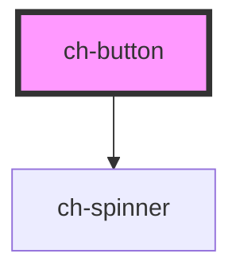

# ch-button

<!-- Auto Generated Below -->

## Properties

| Property   | Attribute  | Description                                                                                                                                                    | Type                                              | Default     |
| ---------- | ---------- | -------------------------------------------------------------------------------------------------------------------------------------------------------------- | ------------------------------------------------- | ----------- |
| `disabled` | `disabled` | Whether the button is disabled.                                                                                                                                | `boolean`                                         | `false`     |
| `href`     | `href`     | When set, the button renders as an `<a>` pointing to this URL while keeping the button styling.                                                                | `string`                                          | `undefined` |
| `label`    | `label`    | Accessible label set as `aria-label` on the native element. Use it when the button's content doesn't convey its purpose on its own (e.g. an icon-only button). | `string`                                          | `undefined` |
| `loading`  | `loading`  | Whether the button is loading. Shows a spinner, disables interaction, and announces the busy state with `aria-busy`.                                           | `boolean`                                         | `false`     |
| `size`     | `size`     | The size of the button. One of `sm`, `md`, or `lg`.                                                                                                            | `"lg" \| "md" \| "sm"`                            | `'md'`      |
| `target`   | `target`   | The browsing context the link opens in (e.g. `_blank`). Only used when `href` is set. For `_blank`, a `noopener noreferrer` `rel` is added automatically.      | `string`                                          | `undefined` |
| `variant`  | `variant`  | The visual style of the button. One of `primary`, `secondary`, `ghost`, or `danger`.                                                                           | `"danger" \| "ghost" \| "primary" \| "secondary"` | `'primary'` |

## Events

| Event     | Description                         | Type                      |
| --------- | ----------------------------------- | ------------------------- |
| `chClick` | Emitted when the button is clicked. | `CustomEvent<MouseEvent>` |

## Slots

| Slot      | Description      |
| --------- | ---------------- |
|           | The default slot |
| `"end"`   |                  |
| `"start"` |                  |

## Dependencies

### Depends on

- [ch-spinner](../ch-spinner)

### Graph

----------------------------------------------

*Built with [StencilJS](https://stenciljs.com/)*
